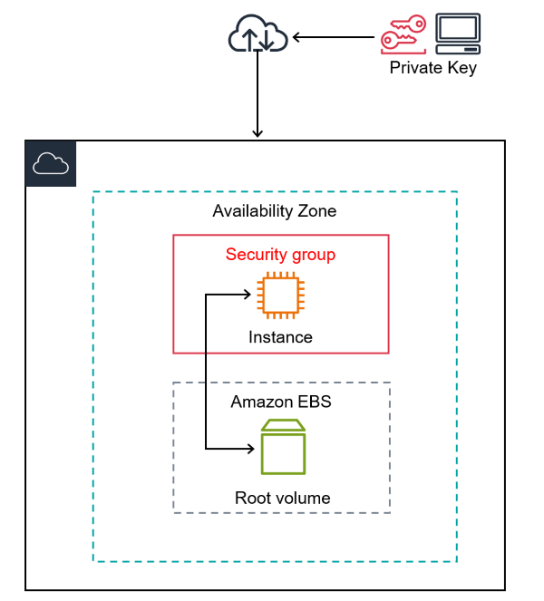
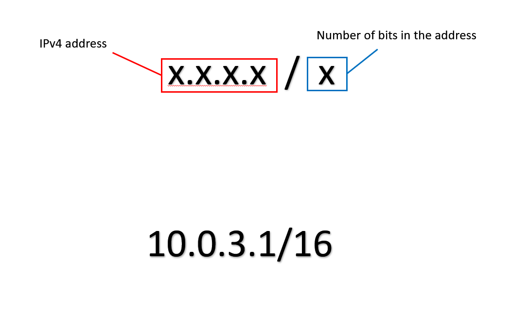

## What are AWS instances?

AWS is a service that allows you to deploy virtual computers.

These are functionally similar to computers ran locally, but are ran on AWS servers over the cloud.

This allows you to have all the benefits of local machines but without having to buy, set up and maintain them.

Can connect to these and use them like regular machines, as well as save their state as an AMI.

These can be used to run servers and networks using VPCs.

## What are VPCs?

Like a real network, VPC architecture consists of many important components.

CIDR blocks
- Cidr blocks are essentially a range of IP addresses. 
- The numbers after the slash denotes what part of the IP address you can use and what you cannot, you take this away from the total bits in the address. 
- Each number in the address denotes 8 bits, so 16 means you can only use the last two numbers of the address (32 bits - 16 bits = 16 bits).
- Cidr blocks define the IP address range, and are **NOT** the IP address itself.
- IF TWO VPCS COMMUNICATE THEY NEED UNIQUE CIDR BLOCKS!!!

## Why would you want to use a custom VPC?

Mainly increased security. Though, there are other benefits.

Default VPCs:
- Security groups
- SSH keys

Private VPCs:
- Security groups
- SSH keys
- VPC not visible to everyone as they're not public
- Can decide if subnets are public or private
- Can pick availability zone for each subnet

## Process of creating a custom VPC
