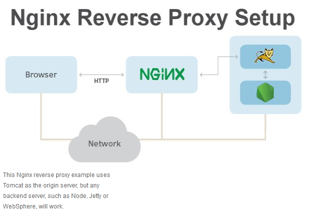

## Deploying a node app on an Ubuntu AWS instance

### Setting up AWS instance for app deployment

First, the instance needs to be set up, refer to [Setting_Up_AWS_Instance.md](..%2FSetting_Up_AWS_Instance%2FSetting_Up_AWS_Instance.md) on how to do this.

Additionally, you need to make a security group for port 3000 because node apps run on this port. To do this you add a security group in the same way you do for HTTP or SSH. However, instead, from the **Type** drop down menu, you select **Custom TCP** and in the **Port Range** box you input the port '3000'. Remember to save after this is done.

### Moving files to instance

To move your app to the instance where it will be deployed, you can use `scp` to do this.

`scp -i "<filepath to .pem file>" -r <filepath to your local app folder> Ubuntu@<public IP DNS>:<remote filepath>`

`-i "<filepath to .pem file>"`: Where your private key is located, in order to authenticate login.

`-r <filepath to your local app folder>`: The file that will be copied over to instance. The `-r` stands for 'recursive' and means 'copy folder and all it's contents'.


### Installing necessary packages on instance and starting your app

First, you need to connect to your Ubuntu VM webserver (in our case this is running Ubuntu 18.04).

This is done using `ssh`: 
`ssh -i "<filepath to .pem file>" ubuntu@<public IP DNS>`

Then we need to ensure node js is installed, in our case specifically version 12.x.

First, input this, which identifies the version to install: `curl -sL https://deb.nodesource.com/setup_12.x | sudo -E bash -`

Then next, tell shell to install node js: `sudo apt-get install -y nodejs`

We also need to install node package manager and pm2: 
```
sudo npm install pm2 -g
npm install
```

Finally, we can then start the app. The app will be viewable on port 3000 of the public IP address.

`node app.js`

### Reverse proxies

The nginx reverse proxy works in the following way:

- Server receives HTTP request
- Request inspected
- Depending on the request, user gets a response from backend with specific port

Functionally, this allows us to change default port. So, we could make the default response to HTTP requests be to forward the user to port 3000, displaying our app by default when a user connects to the site.



Can also have the reverse proxy navigate through firewalls for security.

First, install nginx...
```
# Update
sudo apt-get update -y

# Upgrade
sudo apt-get upgrade -y

# Install nginx
sudo apt-get install nginx -y
```

Then, we need to add a proxy pass setting. 
```
# Open the 'default' config file using nano
sudo nano /etc/nginx/sites-available/default
```

Then set it up so by default this redirects to app.
```
# This should work, can put something different like /homepage too but in this case we leave it blank
location / {
  proxy_pass http://<IP>/;
}
```

You *CAN* also set up headers, but these have default values they'll go to if none are set.
``` 
# Headers are set under the proxy pass setting
location / {
  proxy_pass http://<IP>/;
  proxy_buffering off;
  proxy_set_header X-Real-IP $remote_addr;
  proxy_set_header X-Forwarded-Host $host;
  proxy_set_header X-Forwarded-Port $server_port;
}
```

Finally, need to restart nginx!
``` 
sudo systemctl restart nginx
```