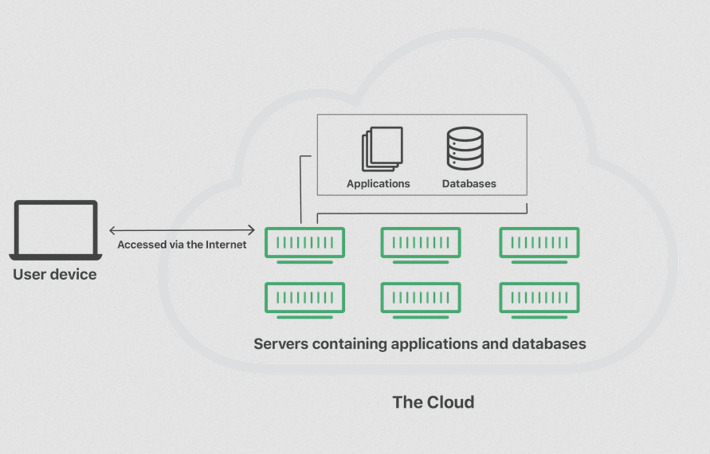

# This is a general overview for Cloud Computing with AWS. For more specific AWS tutorials, go to the following links:

Bash commands useful when working with AWS remotely: https://github.com/jbjoeburns/AWS_CC/blob/master/Linux/Linux_Commands.md

Creating basic AWS EC2 instance: https://github.com/jbjoeburns/AWS_CC/blob/master/Setting_Up_AWS_Instance/Setting_Up_AWS_Instance.md

Overview of AMIs: https://github.com/jbjoeburns/AWS_CC/blob/master/Setting_Up_AWS_Instance/AMI.md

What is user data and how to use it: https://github.com/jbjoeburns/AWS_CC/blob/master/Setting_Up_AWS_Instance/userdata.md

Using the pm2 package: https://github.com/jbjoeburns/AWS_CC/blob/master/pm2/What_is_pm2.md

Deploying a NodeJS app on AWS instance: https://github.com/jbjoeburns/AWS_CC/blob/master/Deploying_Node/Node_Deployment.md

Setting up a reverse proxy to NodeJS app: https://github.com/jbjoeburns/AWS_CC/blob/master/Reverse_Proxy/Reverse_Proxy.md

Running MongoDB on AWS instance: https://github.com/jbjoeburns/AWS_CC/blob/master/MongoDB/MongoDB.md

Two-tier archetecture: https://github.com/jbjoeburns/AWS_CC/blob/master/2_tier_architecture_walkthrough/walkthrough.md

Creating a two-tier VPC: https://github.com/jbjoeburns/AWS_CC/blob/master/VPCs_and_subnets/VPCs.md

Creating load monitoring dashboard: https://github.com/jbjoeburns/AWS_CC/blob/master/load_monitoring/load_monitoring.md

Usage alarms on CloudWatch: https://github.com/jbjoeburns/AWS_CC/blob/master/load_monitoring/Creating_CPU_usage_alarm.md

Setting up ASG: https://github.com/jbjoeburns/AWS_CC/blob/master/load_monitoring/autoscaling.md

AWSCLI and buckets: https://github.com/jbjoeburns/AWS_CC/blob/master/Buckets_and_AWSCLI/Buckets_and_AWSCLI.md

## Cloud Computing

**What is it?:** Cloud computing is the ability to store and access data, applications, databases, as well as accessing computing power using rented remote servers as opposed to physical servers.

tl;dr Computing resources over the internet.

## History of Cloud Computing

DARPA initially funded MIT to develop ARPANET in 1969, the first iteration of what would become the internet. SalesForce in 1999 was the first to initially use cloud computing commercially to deliever software programs to end users who could purchase access to them. 

In 2002 Amazon introduced web-based retail services, then in 2006 they launched Amazon Web Services (AWS), which is the current leader in cloud computing services. Following this, various other cloud services were launched, such as Microsoft Azure and Oracle Cloud, with cloud computing being a common tool from than onwards.

## Cloud Computing Uses

The major advantage to cloud computing is that it allows you to use computing resources that would not be practical to physically own. 

This allows you to:
1. Store massive amounts of data
2. Data analysis with high processing power
3. Software testing
4. And many more things...

## 4 Types of Cloud

Private clouds: Cloud environments for use by a single end user, or group of end users.

Public clouds: Cloud environments not owned by the end user, eg AWS.

Hybrid clouds: Cloud environment created from multiple environments, uncluding LANs, WANs, VPNs and APIs typically consisting of more than one cloud, with it possibly being a combination of public and private.

Multiclouds: More than 1 cloud service from more than 1 cloud vendor, public or private.

## Different Types of Cloud Service

Infrastructure as a Service (IaaS): Contains basics for cloud IT including networking features and storage. Allows you to build your system to suit your needs.

Platform as a Service (PaaS): Provides underlying infrastructure like updates, maintenance, patching and other aspects of running your application.

Software as a Service (SaaS): Provides completed functional cloud product ran by the service provider to give access to specific software available on the service.

Pick based on how much control you need, in exchange for having to manage the service more...

## Advantages/Disadvantages of Cloud

Adv:
- ONLY NEED TO PAY FOR WHAT YOU NEED! Cost savings!!!
- Effective way of backing up data
- Can access data on any machine, ***good mobility***
- Easily ***scalable*** with upgrades that allow for expansion, and scale down when demand drops
- Secure
- Cost savings as no need to invest or maintain hardware
- Easy to manage cost, provided its managed properly
- Use what you need
- Global reach, ***good mobility*** can go global in seconds
- Easy to keep up with market trends
- Improved collaboration by working on the same server
- Economy of scale, big organisations can operate on a larger scale and pass savings on to you/your business

Disadv:
- Data held by third party, requires trust and reputation
- Difficult to migrate from providers
- Need internet to access data
- Subject to data breaches
- Can lose money if you keep paying for servers you're not using
- limited control or customisation
- Data laws differ by country
- Downtime can affect business 
- Expertise needed

## OpEx vs CapEx

Different types of business expenditures...

CapEx: Capital expenditures. These are purchases of significant services in bulk, even if you dont use all of it. Eg. Buying a gallon of water and only using 500ml of it, the rest is wasted.

OpEx: Operating expenditures. The costs of running the business day to day. In the context of cloud computing this refers to the costs of renting current services as you use them. Eg. having a resivour of water owned by someone else you can take from, and only taking what you need at a given time and being charged for that only.

OpEx is also more flexible to change. If you own an outdated server, you will have to pay for upgrades. However, if you rent the server, upgrades are covered by the company you're renting from so therefore updates will be swift and free.

Ideally want more OpEx over CapEx, and moving things currently under CapEx to OpEx. You want to purchase only what you need, and rather than buying servers you can rent them so you only pay for what you need (the use of the server) rather than paying for it all (the physical server and people to maintain them).

## Marketshare

Market share is the percentage of total sales in a given industry generated by a specific company.

AWS: 32%
GCP: 11%
Azure: 22%
Others: 35%

## Three Largest Cloud Providers

AWS: Largest market share, and provides primarily IaaS. Well known for high scalability and quick startup process.

Azure: 2nd largest market share. Used often for all three IaaS, PaaS and SaaS and has good interactivity with other Microsoft products.

GCP (Google Cloud Platform): 3rd largest market share. Specialised for AI, machine learning, data analysis and Kubernetes.

## 4 Pillars of DevOps and How They Relate to the Cloud

Sharing/Collaboration: Cloud computing can allow for multiple users to access the same storage/system for collaborative work on a project stored there.

Automation: Cloud services allow for automation in regards to tasks and upscaling.

Communication: Cloud computing has uses in communication through communication services that can be provided through the cloud like outlook.

Monitoring: Cloud services provide means to monitor your cloud hosted applications and their performance and any issues they're encountering.

Aim for...
- Easy to use, so people don't move to other systems
- Flexible and can change with the industry, don't make systems that rely too much on one app/service
- Robust, with high uptime 
- Be cost effective while not compromising on other factors like efficiency 

## AWS

Structure:
- London is the region
- London has 3 availability zones (essentially data centers)

Uptime is kept high due to the multiple availability zones. If one data center goes down, then can use the others as a backup.

However; Not all services are available in every region. Additionally, they can vary in price depending on regions too.

Elastic compute clouds expand computing power depending on what's needed. Amazon calls this EC2.

AWS calls it's virtual machines in this server "instances".

***MAKE SURE TO ALWAYS USE IRELAND AS YOUR REGION (in the top right corner), ALWAYS DOUBLE CHECK!!!***

