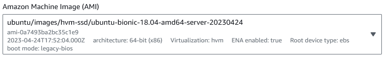
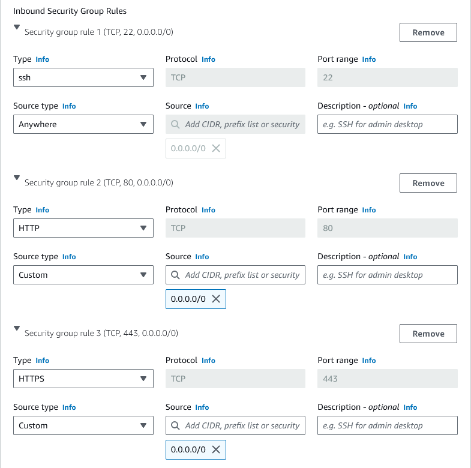

## Getting to the launch instances page
Navigate to the following...
1. Services
2. Compute
3. EC2
4. Instances
5. Launch Instances

## Instance Setup
**Name**

First need to input name. There are specific guidelines for this:
- Always starts with "tech254_joe_"
- End with something descriptive, in this case testvm
- So in total, ***"tech254_joe_testvm"***

Next need to pick an Application and OS image. Amazon calls these "Amazon Machine Images" or AMIs. These are captured 'screenshots' of virtual machines, with important applications and specific OSes preinstalled, depending on the AMI selected.
- We can select recommended AMIs here, with a common choice being ***Ubuntu*** and using the 2nd free tier down from the top.
- However, in this case we will be selecting the one in the picture below...
  - We use this one because it is the Ubuntu version nginx is able to run on

- Instance type should be t2.micro (free tier)

Then we set up security details...
- Key pair should be ***tech 254***
- Storage and advanced settings can also be configured on this page, but we will avoid that for now
- Under the network settings, we setup the ***security groups***
  - These are settings that allow you to choose who can connect to which ports on your server
  - More detailed setup can be done by clicking ***edit*** which allows us to set up custom security group
  - Custom security groups need to be ***named*** using the same rules as the instance names
    - In this example, we will name ours ***"tech254_joe_testsg"***
  - A ***description is also required***, but if our name fits the naming convention standards, it will also be appropriate as a description under normal circumstances
  - As for ***security group rules*** we need an ***SSH*** one to access our instance using GitBash SSH key pairs
    - This enables us to securely connect and install software as a superuser, among other important operations, without this being accessible to people without a key
    - Under some circumstances we would want SSH connections to only be allowed from certain IPs, for security reasons
  - Additionally, we want HTTP and HTTPs ports too, so we can connect via a web browser
    - We should accept IPs from 0.0.0.0/0, as this means all IPs are allowed to connect to this port
  - Rules should look like the image below... 

## Connecting via SSH and Installing nginx

**Connecting to the server**
1. Open GitBash as administrator
2. Change directory to the directory with the .pem file
   - `cd <filepath>`
3. Next, give read permission to yourself, for the .pem file 
   - `chmod 400 <filename>` (chmod changes system access permissions, 400 is for read)
4. Then, connect via ssh, referencing the .pem file where the private key is located as an argument and the public address too
   - `ssh -i "<pem file>" ubuntu@<pub address>` (the ubuntu bit is the user, can also log in as root with different permissions)
5. You have now accessed the server!

**Installing nginx**
1. Good practice to update all software! Also incedently confirms that you have internet connection.
   - `sudo apt update`
2. Can also upgrade, but be careful as this may cause version issues. Upgrades any updated software to the latest installed version. The -y is 'yes' for a confirmation later that will ask you if you're sure.
   - `sudo apt upgrade -y`
3. Installs software. The 'name' refers to the name of the software, in this case, nginx.
   - `sudo apt install <name> -y`
4. Now need to start nginx.
   - `sudo systemctl start nginx`: Starts nginx.
5. Then check if nginx is correctly running.
   - `sudo systemctl status nginx`

Once everything is set up you can then connect via the server IP in a browser.

## Important Definitions

Images are a snapshot of an OS and files/software at a specific point in time.

.pem stands for privacy enhanced mail, encrypted file with keys contained within.

URL is the human-readable form of the IP address set up by websites for easier user experience.

IP address tells you were to go **for** the server, where port is where to go **on** the server.
- For example, if you were to connect to the server via HTTPS, this will redirect you to port 443
- As security groups dictate what IPs can and can't connect to what ports, and what ports are available, port 443 will be the intended port for end users, and will likely direct to something like a homepage for example.
