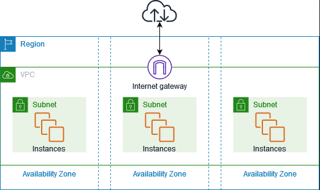
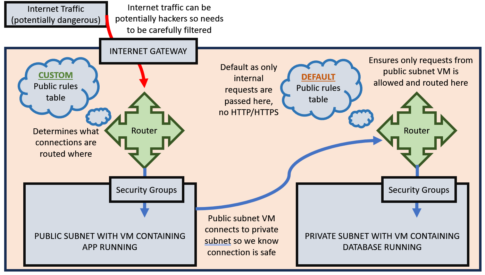
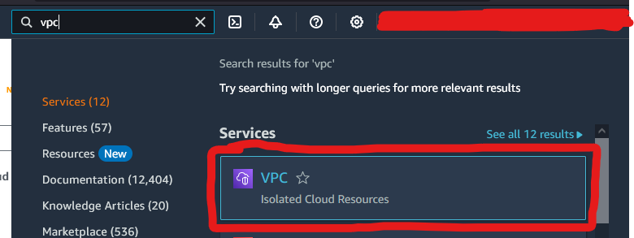
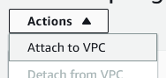
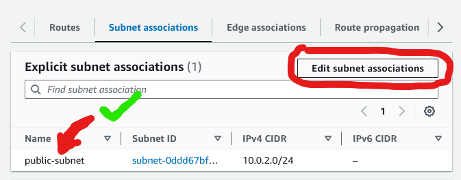
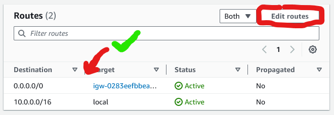
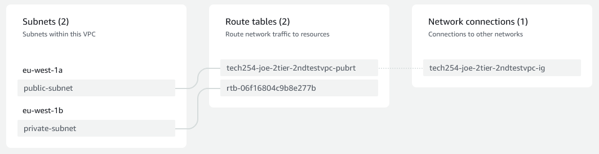

## What are VPCs?

VPCs are essentially just virtual networks. Conceptually the network equivalent of virtual machines.

They consist of a VPC, containing multiple subnets. The VPC accepts traffic through an internet gateway, or another subnet and a router routes the packets to the network security groups in the correct subnets.

For example:
- Availability zones are public VPCs
- And 1a, 1b, etc... are public subnets

Everyone shares AWS when you create cloud instances on the public cloud because public availability zones are contained within the default VPC.

However, VPCs are an independent entity to AZs and public subnets.



"The following diagram shows an example VPC. The VPC has one subnet in each of the Availability Zones in the Region, EC2 instances in each subnet, and an internet gateway to allow communication between the resources in your VPC and the internet."

From: https://docs.aws.amazon.com/vpc/latest/userguide/what-is-amazon-vpc.html

## Why use VPCs

Default VPC has access to baseline security like:
- Security groups
- SSH keys

However, private VPCs have:
- Security groups
- SSH keys
- VPC not visible to everyone as they're not public
- Can decide if subnets are public or private
- Can pick availability zone for each subnet

Private VPCs are free.

# Setting up VPCs

We're going to set up public VPC in subnet 1a and private in subnet 1b.

Cidr block we will be using: 10.0.0.0/16
- Cidr blocks are essentially a range of IP addresses. The 16 denotes what part of the IP address you can use and what you cannot, you take this away from the total bits in the address. So each number in the address denotes 8 bits, so the 16 means you can only use the last two numbers of the address (32 bits - 16 bits = 16 bits).
- Cidr blocks define the IP address range, and are **NOT** the IP address itself.
- IF TWO VPCS COMMUNICATE THEY NEED UNIQUE CIDR BLOCKS!!!

Cidr blocks can also be set for subnets specifically, which is what we will be doing.

In our case we'll use 10.0.2.0/24 for the public subnet and 10.0.3.0/24 for the private one
- As the IP for the network ends in 16, we can change the final two numbers and chose 2 as the 2nd to last number.
- Then the IP for the public subnet can only vary in its final number, but the 2 has already been changed.
- So the public subnet can be 10.0.2.x where x is (almost) any number.

Our public subnet will use our **app VM** and our private one will use our **database VM**!

We need a router to ensure packets coming through the internet gateway go to the correct network security group destination, however these are made automatically **THOUGH** we need to create a route table so the router knows where to send packets.
- In our case, we want internet gateway packets to be routed to the public subnet network security group.
- **ADDITIONALLY,** we need another router to route traffic from the public subnet to the database private subnet network security group.

Can also assign NACL to set up custom rules to allow traffic in and out of security group

Below is a diagram depicting typical VPS structure



## Setup walkthrough

### FIRST CREATING VPC

Go to VPC dashboard.

VPC dashboard is accessed here!



Click on 'Your VPCs' on the VPC side bar, then click 'Create VPC'.

Click 'VPC only' under VPC settings.
- VPC and more can be used to set up your VPC structure, but we don't need this.

Give appropriate name as usual.

Provide CIDR block (in our case 10.0.0.0/16) under IPv4 CIDR.

Leave everything else default, then create VPC!

### SECOND, CREATING 1 PRIVATE AND 1 PUBLIC SUBNETS

Go to subnets on the dashboard and create subnet.

Select my VPC from drop down menu.

Give appropriate name again (but don't necessarily need username, as this will be connected to our VPC).
- eg. 'private-subnet' would be a good name

You need to select the availability zone your subnet is in.
- You want to choose, or amazon will pick randomly and this could result in 2 being in the same AZ, which makes server more susceptible to downtime

Then define CIDR block again (in our case 10.0.2.0/24 for public, 10.0.3.0/24 for private).

Finally, click ***ADD NEW SUBNET!!!*** to make the private subnet as well (not create subnet yet).

Repeat the same steps, but with a different name of course, a different AZ and different CIDR block.

Then we can create subnet.

### THIRD, CREATING THE INTERNET GATEWAY

Click internet gateways in VPC dashboard, then click create internet gateway.

Put in an appropriate name, then click create internet gateway.

Finally, click on the actions dropdown on the summary page then attach your VPC.



### FOURTH, CREATE PUBLIC ROUTE TABLE

Click on route tables in the dashboard, then create route table.

Give an appropriate name and associate with your VPC, then create.

(Our blank route table is the private one and does not need to be created, in case you get confused.)

### FIFTH, CONNECT ROUTE TO SUBNETS

On route table summary page, click subnet associates then edit subnet associations under explicit associations.

Tick public subnet then save associations.



### SIXTH, ADD INTERNET GATEWAY AS PART OF THE PUBLIC ROUTE

Click on routes tab in route table summary page, and click edit routes.

Click add route.

Destination is the final destination of the route...
- For us we'll put 0.0.0.0/0 as we want all IPs to be able to access internet gateway

Target is the thing we're adding to the route...
- For us this is the internet gateway

Save changes.

Together, this will allow all connections to the internet gateway.



### SEVENTH, TEST IF EVERYTHING WORKS

Go back to VPCs and your VPC summary page.

Look at resource map, you should expect something similar to this...



### EIGHTH, MAKE EC2 INSTANCE FOR DB INSTANCE

Go back to EC2 instances page, AMIs then launch instance from your **database** AMI.

Go to AMIs and launch instance from desired AMI (need to do it this way because of DB not having internet access and need pre-installed software).

Set up like normal, but need to change ***network settings***!
- Click edit 
- Search for VPC and select it
- Select **private** subnet
- Leave public IPs as **disabled**
- Then create DB security group
  - NEED TO MAKE NEW ONE AS SECURITY GROUPS ARE ASSOCIATED WITH THEIR VPCs
  - Use **SSH** and **mongo** ports (22 and 27017)
  - Can set source type to specific IP sources, but we'll just use anywhere for now

### NINETH, MAKE EC2 INSTANCE FOR APP INSTANCE

Launch instance from AMI and select our app AMI.

Set up like normal, but need to change ***network settings***!
- Click edit 
- Search for VPC and select it
- Select **public** subnet
- **enable** public IPs
- Then create app security group
  - NEED TO MAKE NEW ONE AS SECURITY GROUPS ARE ASSOCIATED WITH THEIR VPCs
  - Use **SSH** and **HTTP** and **node** ports (22 and 80 and 3000)
  - Can set source type to specific IP sources, but we'll just use anywhere for now
  - Can skip over node port, but its best to keep it since it can be useful if anything goes wrong and fixing the issue

THEN include **user data**!
VERY VERY IMPORTANT TO DO EXPORT COMMAND WITH CORRECT IP, COPY PRIVATE IP FROM DB INSTANCE (this IP will **NOT** just be 10.0.3.0/24, PLEASE copy it because I know I'll forget this unless I remind myself!)
```
#!/bin/bash

# Export command, to find db
export DB_HOST=mongodb://3.250.90.26:27017/posts

# move to app directory
cd /home/ubuntu/app/app
sudo systemctl restart nginx

# install node (may not need this if using instance with it already installed)
sudo npm install

# seed db
sudo node seeds/seed.js

# install pm2 (may not need this if using instance with it already installed)
sudo npm install pm2 -g

# kill, in case anything else is running
pm2 kill

# start app
pm2 start app.js
```

Then launch.

The IP attached to this instance will be the one needed to visit your site.