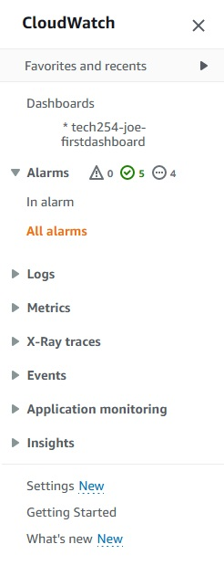
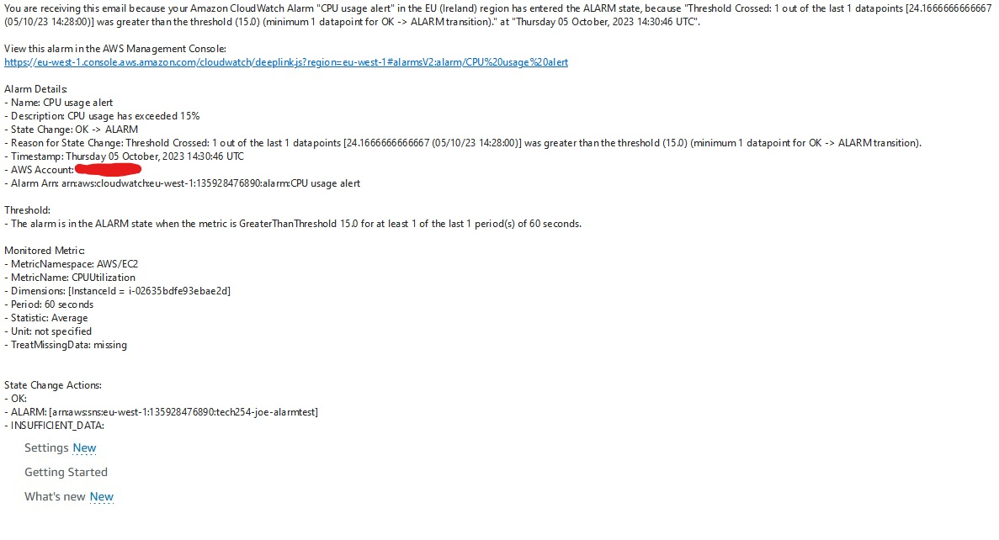

## Making CPU usage alarm

First, go to the cloudwatch console page.

From here, on the side panel click **all alarms**, under the alarm section.

You can then create an alarm.
- Make sure to give the alarm an appropriate, descriptive name!

Next you need to find the instance you want the alarm to track, in this case the instance ID for your AMI which can be searched for, but is also in EC2 metrics. 

Then you can select the metric you want to track, in this case CPUUtilization. This can also be searched for.
- Tick the box then select metric.

Next, you can specify metric conditions. In this case we will set the threshold value as **15 (15% CPU usage)** and **greater than**, so when CPU usage is over 15% the alarm will activate.

You can also select how often the CPU usage will be checked by the alarm under the **period** section.

Then, we can create a new SNS topic to be notified, in this we can give it an appropriate name again, and provide the email address we want notifications to be sent to.
- A minute or so following this, you will get an email asking for confirmation. Confirm the email address to receive alarms.

Finally, we can create alarm.

An alarm sounding alert will look like this!

