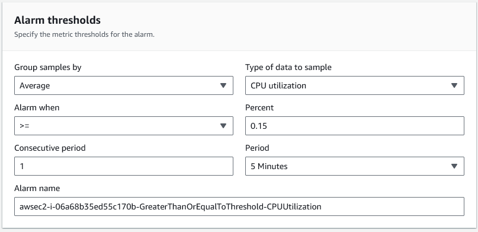

## High availability scalability (HA SC)

We can set up a system that automatically sets up more VMs when the CPU load threshold is reached, which is done to avoid exceeding 100% usage and therefore crashes and downtime.

There are a number of different ways to ensure disasters don't happen, such as your application crashing. Auto scaling is just one of those measures.

Means of disaster prevention include...
- Monitoring dashboards
  - These allow you to track certain important metrics such as CPU usage, vRAM usage and others.
  - If these get too high, they will be visualised in a graph and measures can be taken to prevent this causing disasters.
  - However, this requires constant monitoring by a human. Bad for automation and easy to miss any changes that could predict disasters.
- Alarms
  - These will notify you via email when a metric exceeds a preset threshold.
  - Practically, this could be used to notify an individual if, for example, CPU usage reaches dangerous levels so a new instance can be created to shoulder some of the burden.
  - Unlike dashboards, this doesn't require constant attention.
  - However, this requires human intervention so is poor for automation
- Auto scaling
  - The ideal solution to preventing high CPU usage related disasters.
  - This will create a new instance automatically to shoulder the burden of high CPU, automatically mitigating the issue.
  - This is far less susceptible to human error, and requires little attention.
  - However, autoscaling doesn't invalidate alarms and dashboards.
  - Dashboards still have use in tracking metrics over time, and can be used to inform permanent up and downscaling decisions and changes to auto scaling settings.
  - Alarms are also useful if unexpected traffic causes high CPU when the maximum number of instances defined by auto scaling parameters has already been reached, so changes can be made to parameters to allow for greater auto scaling and preventing disaster.

Need to allow VM to make more VMs. This can be done with a **launch template**.
- **Launch template** is the parameters/settings we want for our VM, like when we usually set them up. This can be read by the **auto scaling group**.
- Basically acts like instructions for our auto scaling group to follow when making new instances.

Auto scaling group has parameters it needs to work by
- Max group size
- Min group size
- Desired group size
- Region(s) you want to use and availability zones
- In our case, we will set these as 3, 2 and 2 respectively, in ireland.
- Scaling policy (eg. how much %CPU usage until autoscaling triggers)
- And others...

We also need a load balancer to ensure traffic is distributed evenly among availability zones, to avoid congestion.
- Redirects traffic based on VMs being down and current traffic.
- The VMs created this way are evenly spread across availability zones (1st goes into 1A, then 2nd to 1B, then 1C, then 1A again and so on).

Together, this creates a complex system that allows dynamic creation of VMs in response to traffic and CPU usage, minimising potential downtime.



## Setting up auto scaling launch template

Go to EC2 then **launch template** (under instances tab).

Create launch template and give it an appropriate name.

Pick usual parameters, and make sure that user data is provided!

eg...
``` 
#!/bin/bash

cd /home/ubuntu/app/app
sudo npm install pm2 -g
sudo systemctl restart nginx
npm install
pm2 kill
pm2 start app.js
```

This is the information the ASG will use to launch new instances.

MAKE SURE TO TEST TEMPLATE AT THIS PHASE!!!

If it doesnt work and you continue, you could waste a lot of time!

To test...
- Click launch instance from template.
- Click add new tag under resource tags.
- Select name and give an appropriate name.
- Can click actions, then launch from template to launch with all of our the preset parameters.

## Setting up ASG

Click on auto scaling groups, at the bottom on the sidebar, and create group.

Give an appropriate name, and provide it with our launch template.

Set availability zones in launch options (in our case, devops student default EU-W 1a, 1b and 1c)

On step 3, we can create the ***load balancer***!

## Setting up load balancer

Then we can create a new load balancer, which needs to be an application load balancer (as we use HTTP)

We want it to be internet facing as we're not connecting via intranet (not intended to be internal network).

Need to go into listeners and routing, then we need to set up new target group as the load balancer needs to know what to route the traffic to.

Then turn on elastic load balancing health checks.

## Continuing setting up ASG

Now we have an attached load balancer, we can continue setting up our ASG.

We need to set up set group size parameters, which is what we want the max, min and desired number of VMs created by the ASG.
- Max = 3
- Min = 2
- Desired = 2

We also need to set up scaling policies
- Click target tracking scaling policy
- Then to track CPU usage to know when to make new instances click average CPU utilisation as metric type
- Then set the threshold before you want a new instance being made, in our case 50%

Can also set up alarms to notify when new instance is made/destroyed

We can also add tags to keep track of instances made by this ASG
- Key will be "Name", as we want to give new instances names, then put the name we want in the value field

Then finally we need to route this through the load balancer
- This just means, when we connect to our instance we do it using the DNS name from the load balancer
- Therefore, we will connect to the LB, which will then allocate us an instance depending on traffic/CPU load per instance